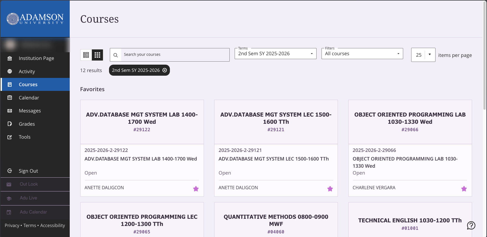

# BB-Better-Layout

This is a Chrome extension. 
It enhances Blackboard Ultra's functionality by maximizing screen space.
New features include a vertical sidebar, automatically generated text banners, and customizable quick links for a smoother workflow.

## Feature

- Side navigation bar
- Simple subject banner
- Back to top button
- Faster & Simple and more

## What you can do with this extension
- Use keyboard shortcuts to check the courses.
- Switch to the PC version appearance.

## Version
- v 2.5    Date: 2026/07/20 
- v 2.5.1   Date: 2026/07/21

## Changes
- Add new appearance.
- Fix keyboard shortcuts.
- Improve the layout.
- Add backto top button.

## Shotscreen

- Courses Page  

 
- Extensions Settings Page  

- Single Course  
