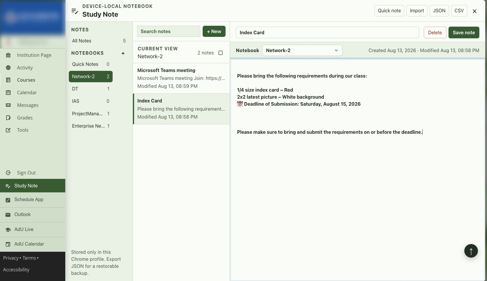
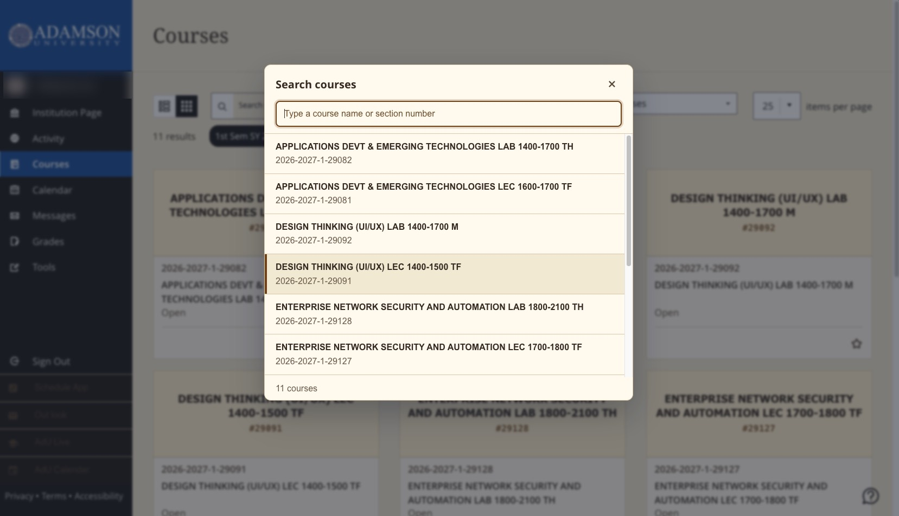

# BB Better Layout for Adamson

This Chrome extension is designed for Adamson University students.
It enhances Adamson University's Blackboard Ultra experience by maximizing screen space.
New features include a vertical sidebar, automatically generated text banners, and customizable quick links for a smoother workflow.

This is an independent student project. It is not affiliated with, endorsed by, or officially supported by Adamson University, Anthology, or Blackboard.

## Privacy and Support

- [Privacy Policy](PRIVACY.md)
- [Changelog](CHANGELOG.md)
- [Manual Testing](TESTING.md)
- [Support and issue reports](https://github.com/dukehug/BB-Better-Layout/issues)

## Features

- Side navigation bar
- Simple subject banner
- Back to top button
- Nine reading appearances and customizable keyboard shortcuts
- Optional device-local custom image for course-page covers
- Context-aware keyboard search for Courses, Course Content, and Roster pages
- Device-local Study Note workspace with notebooks, search, quick notes, and JSON/CSV export

## What you can do with this extension
- Search courses from the Courses page, course materials from an outline, or members from a Roster using the same shortcut.
- Choose a comfortable reading appearance.
- Organize notes into notebooks and capture a quick note from any Blackboard page using a customizable shortcut.
- Export Study Note data as JSON for backup or CSV for use in a spreadsheet.

## Version
- v2.10.4   Date: 2026/08/13

## Changes

v2.10.4 - 2026/08/13

- Preserve the main navigation edge shadow while Study Note is open.

See [CHANGELOG.md](CHANGELOG.md) for the complete maintained change history.

## Screenshots

- v2.10.4 Study Note

- v2.6.0 Courses Search

    

- Courses Page  

- Extensions Settings Page  

- Single Course  

