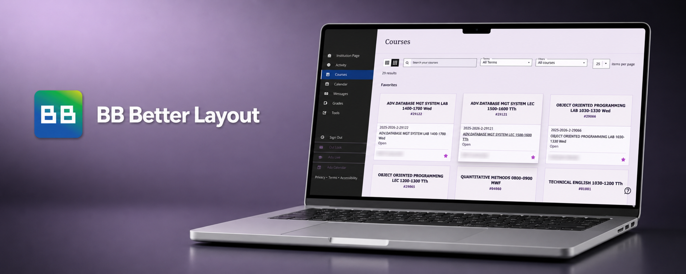
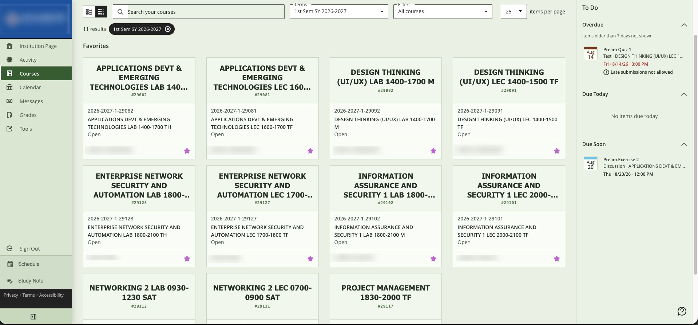
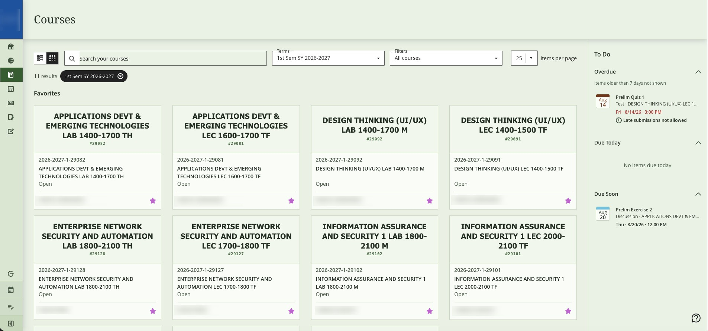
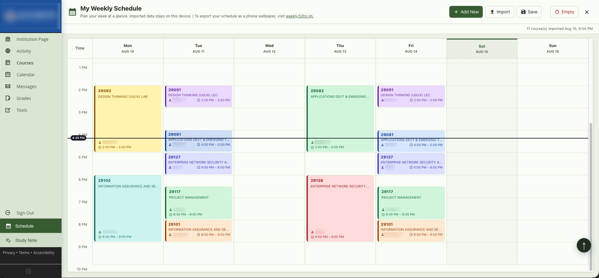
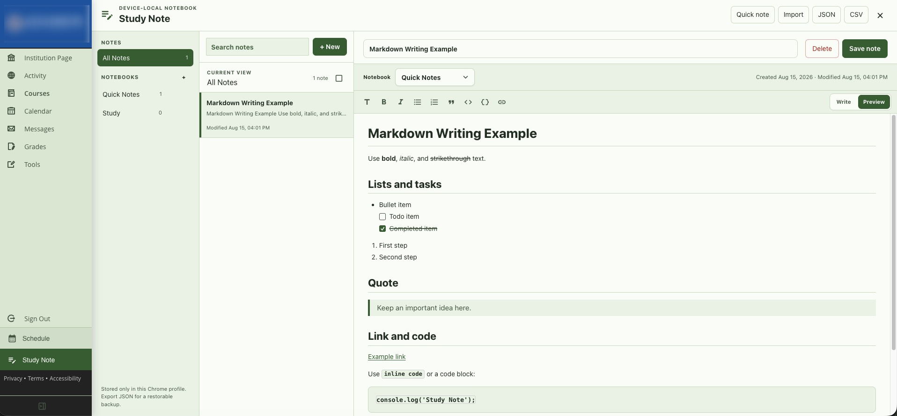
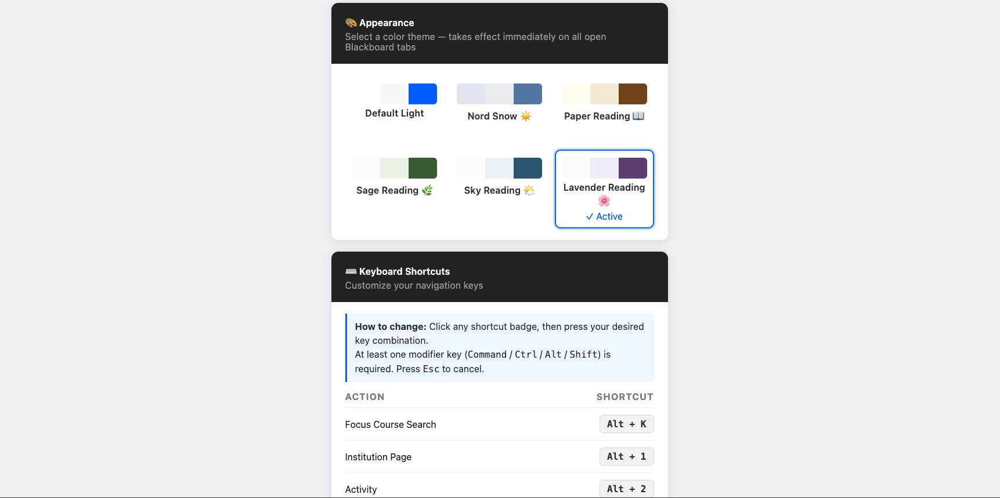
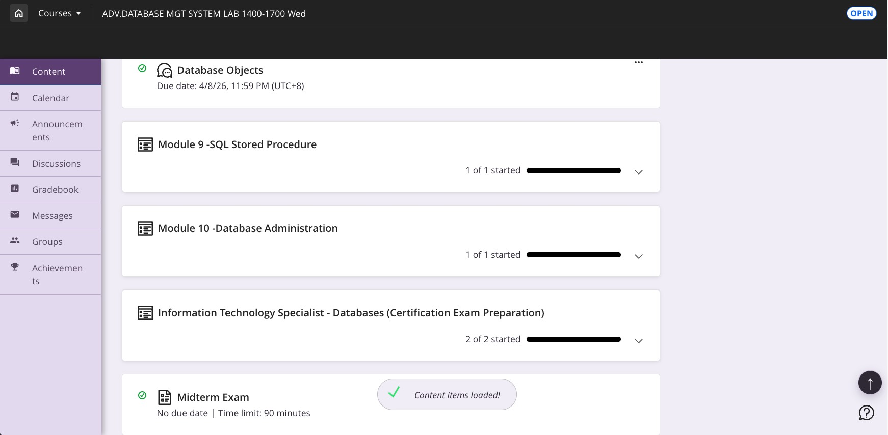

# BB Better Layout

This Chrome extension enhances Blackboard Ultra by maximizing screen space.
New features include a vertical sidebar, automatically generated text banners, and customizable quick links for a smoother workflow.

This is an independent project. It is not affiliated with, endorsed by, or officially supported by Anthology or Blackboard.

## Privacy and Support

- [Privacy Policy](PRIVACY.md)
- [Changelog](CHANGELOG.md)
- [Manual Testing](TESTING.md)
- [Support and issue reports](https://github.com/dukehug/BB-Better-Layout/issues)

## Features

- Collapsible Dashboard side navigation with a persistent 64px icon rail
- Simple subject banner
- Back to top button
- Nine reading appearances and customizable keyboard shortcuts
- Optional device-local custom image for course-page covers
- Keyboard course switching plus context-aware Course Content and Roster search
- Appearance-aware styling for Blackboard's official Courses-page To Do panel
- Device-local Study Note workspace with notebooks, Markdown Write/Preview, search, quick notes, and append-safe JSON/CSV backup import
- Device-local weekly Schedule with explicit Blackboard course import plus editable imported or manual course details
- Up to six optional custom sidebar links with validated URLs and Google Material icons

## What you can do with this extension
- Collapse the Dashboard navigation to icons only and restore it from the footer control without losing your preferred state after a reload.
- Open the searchable Your Courses switcher from a single course without leaving it, while keeping Course Content and Roster search on the separate Search Current Page shortcut.
- Choose a comfortable reading appearance.
- Keep the Courses-page To Do panel visually consistent with the selected reading appearance without losing overdue warning colors.
- Organize notes into notebooks, write and safely preview common Markdown, and capture a quick note from any Blackboard page using a customizable shortcut.
- Export Study Note data as JSON or CSV, then append either backup format later without clearing existing notes.
- Import the currently loaded Blackboard course cards into a weekly timetable only when you request it, or type a manual course name while keeping imported course suggestions available.
- Start with Study Note and Schedule visible by default, then disable either feature without deleting its local data.
- Create your own sidebar destinations, then hide or restore the group without deleting its settings.

## Version
- v2.12.3   Date: 2026/08/29

## Changes

v2.12.3 - 2026/08/29

- Match the Dashboard drawer, legal footer links, and collapse control to every Appearance.

v2.12.2 - 2026/08/29

- Replace Rose Reading with the brighter, accessible Cute Pink Appearance.
- Open Blackboard's native Your Courses switcher from the Courses shortcut while preserving the separate Course Content and Roster search behavior.
- Add Arrow Up/Down selection, Enter navigation, and Escape closing to the course switcher search.
- Center the Your Courses dialog, match it to every Appearance, and keep its search field and floating label readable while focused.

v2.12.1 - 2026/08/15

- Add a safe Markdown Write/Preview editor, formatting toolbar, task checkboxes with completed-task strikethrough, and a one-time Quick Notes writing example.
- Improve Markdown link insertion so a selected URL becomes the destination and its editable label remains selected.
- Append JSON and CSV Study Note backups while preserving existing notes, merging matching notebooks, and avoiding ID collisions.
- Enable Study Note and Schedule by default when no preference has been saved.
- Allow Schedule's Course field to accept a manual name while retaining imported course suggestions and automatic field completion.

v2.12.0 - 2026/08/15

- Add an optional weekly Schedule workspace and sidebar entry.
- Import course names, codes, meeting times, days, and instructor information from the Blackboard Courses page only after an explicit Import click.
- Support `Multiple Instructors`, editable local teacher overrides, manual entries, Room details, course colors, and device-local persistence.
- Add a visible current-time label that updates each minute and week headers that refresh across day, week, month, and year boundaries.
- Keep course names, times, and Room information readable on one-hour and shorter schedule cards.

v2.11.0 - 2026/08/15

- Add up to six user-defined external sidebar destinations.
- Add a settings switch plus name, HTTP(S) URL, and Google Material icon controls for each destination.
- Validate unsafe or malformed URLs, update open Blackboard pages when settings change, and keep saved links when the feature is disabled.
- Bundle the Material Icons font locally for the options-page picker and keep long sidebars scrollable.

v2.10.5 - 2026/08/15

- Add a Google Material Symbols footer control for switching between the full Dashboard navigation and a 64px icon rail.
- Keep the panel control at the bottom, remove its visible text label, and hide Blackboard's legal footer links while collapsed.
-  Match Blackboard's official Courses-page To Do panel to every extension Appearance while preserving its overdue status colors.
- Prevent incomplete keyboard events or legacy shortcut settings from producing a `toLowerCase()` extension error.

v2.10.4 - 2026/08/13

- Preserve the main navigation edge shadow while Study Note is open.

See [CHANGELOG.md](CHANGELOG.md) for the complete maintained change history.

## Screenshots

- Courses Dashboard 

    

- Side Panel Close 

    

- Inner Schedule  

    

- Inner Study Note 

    

- Extension Settings Page  

- Single Course  

## License

[MIT](License.md)
